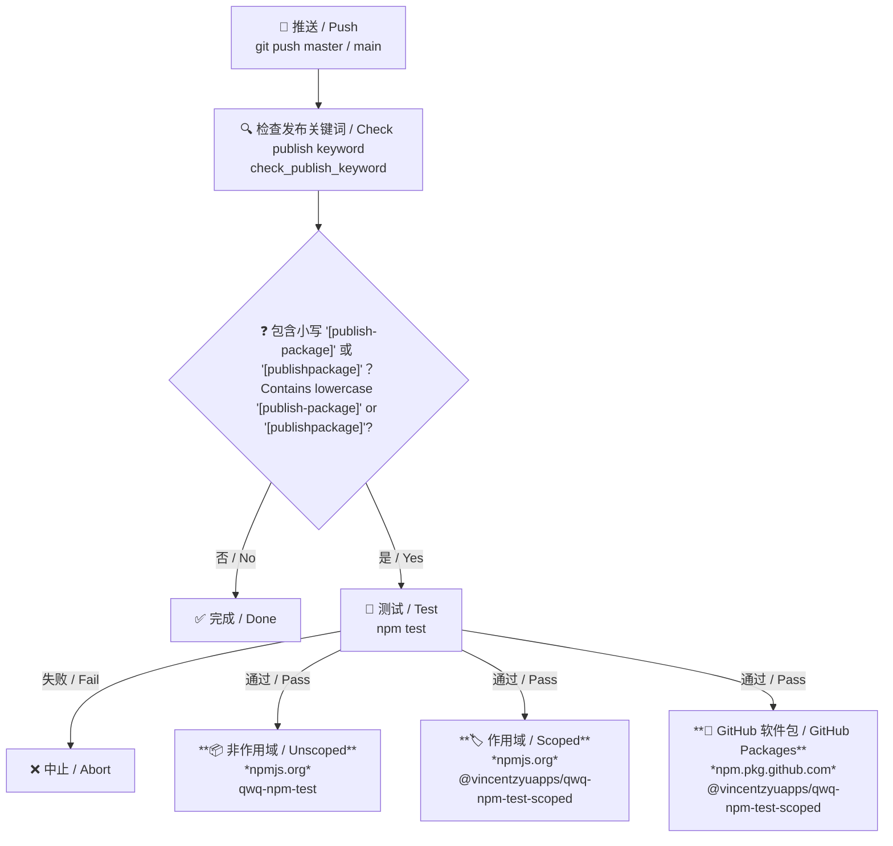

# qwq-npm-test

> 🧪 一个用于评估 npm 生态系统中 GitHub Actions CI/CD 工作流的沙盒仓库。📦<br>
> 🧪 A sandbox repository for evaluating GitHub Actions CI/CD workflows within the npm ecosystem. 📦

[](https://www.npmjs.com/package/qwq-npm-test)
[](https://www.npmjs.com/package/@vincentzyuapps/qwq-npm-test-scoped)
[](https://github.com/VincentZyuApps/qwq-npm-test/pkgs/npm/qwq-npm-test-scoped)

[](https://github.com/VincentZyuApps/qwq-npm-test/actions/workflows/publish.yml)

---

## 📊 软件包概览 / Package Overview

| 注册表<br>Registry | 软件包<br>Package | 类型<br>Type | 徽章<br>Badge |
|---|---|---|---|
| [npmjs.org](https://www.npmjs.com) | [`qwq-npm-test`](https://www.npmjs.com/package/qwq-npm-test) | 📦 npm 非作用域<br>npm Unscoped | [](https://www.npmjs.com/package/qwq-npm-test) [](https://www.npmjs.com/package/qwq-npm-test) |
| [npmjs.org](https://www.npmjs.com) | [`@vincentzyuapps/qwq-npm-test-scoped`](https://www.npmjs.com/package/@vincentzyuapps/qwq-npm-test-scoped) | 🏷️ npm 作用域<br>npm Scoped | [](https://www.npmjs.com/package/@vincentzyuapps/qwq-npm-test-scoped) [](https://www.npmjs.com/package/@vincentzyuapps/qwq-npm-test-scoped) |
| [GitHub Packages](https://github.com/features/packages) | [`@vincentzyuapps/qwq-npm-test-scoped`](https://github.com/VincentZyuApps/qwq-npm-test/pkgs/npm/qwq-npm-test-scoped) | 🐙 GitHub Packages 作用域<br>GitHub Packages Scoped | [](https://github.com/VincentZyuApps/qwq-npm-test/pkgs/npm/qwq-npm-test-scoped) |

## 📚 软件包类型说明 / Package Types Explained

本项目会向 **2 个注册表**发布 **3 个软件包**。以下是每种类型的含义：

This project publishes **3 packages** across **2 registries**. Here's what each means:

| | 📦 npm 非作用域<br>npm Unscoped | 🏷️ npm 作用域<br>npm Scoped | 🐙 GitHub Packages 作用域<br>GitHub Packages Scoped |
|---|---|---|---|
| **软件包名称**<br>**Package name** | `qwq-npm-test` | `@vincentzyuapps/qwq-npm-test-scoped` | `@vincentzyuapps/qwq-npm-test-scoped` |
| **注册表**<br>**Registry** | [npmjs.org](https://www.npmjs.com) | [npmjs.org](https://www.npmjs.com) | [npm.pkg.github.com](https://npm.pkg.github.com) |
| **默认可见性**<br>**Default visibility** | 公开<br>Public | **私有**（需要 `--access public`）<br>**Private** (requires `--access public`) | 私有（组织作用域）<br>Private (org-scoped) |
| **名称唯一性**<br>**Name uniqueness** | 全局唯一，先到先得<br>Global, first come, first served | 在 `@owner` 命名空间内唯一，不会与其他组织冲突<br>Unique under the `@owner` namespace, with no conflicts across organizations | 在 GitHub 组织命名空间内唯一<br>Unique under the GitHub organization namespace |
| **身份验证**<br>**Authentication** | `NPM_TOKEN` | `NPM_TOKEN` | `GITHUB_TOKEN` |
| **发布命令**<br>**Publish command** | `npm publish` | `npm publish --access public` | `npm publish --registry https://npm.pkg.github.com` |

### 📦 npm 非作用域 / npm Unscoped

不带 `@scope` 前缀的软件包必须拥有**全局唯一的名称**。一旦 `qwq-npm-test` 被占用，其他人就不能再使用该名称发布。它们**始终是公开的**，可使用 `npm install qwq-npm-test` 安装。

Packages without an `@scope` prefix have a **globally unique name**. Once `qwq-npm-test` is taken, nobody else can publish under that name. They are **always public** and can be installed with `npm install qwq-npm-test`.

### 🏷️ npm 作用域 / npm Scoped

作用域软件包采用 `@owner/package-name` 格式。名称只需在所属作用域内唯一，因此不必担心被其他作用域抢注。不过，npm 作用域软件包**默认为私有**，公开共享时需要使用 `--access public`。可使用 `npm install @vincentzyuapps/qwq-npm-test-scoped` 安装。

Scoped packages follow the format `@owner/package-name`. The name only needs to be unique within your scope, so you don't have to worry about name squatting. However, npm scoped packages are **private by default**, so you need `--access public` to share them publicly. Install with `npm install @vincentzyuapps/qwq-npm-test-scoped`.

### 🐙 GitHub Packages 作用域 / GitHub Packages Scoped

GitHub Packages 同样使用兼容 npm 的作用域名称（`@owner/name`），但它指向 **GitHub 自己的注册表**（`npm.pkg.github.com`），而不是 npmjs.org。它使用 `GITHUB_TOKEN` 进行身份验证；该令牌在 GitHub Actions 中自动提供，无需手动设置。这非常适合让软件包在**组织内部保持私有**，同时仍可使用 `npm install`。

GitHub Packages also uses npm-compatible scoped names (`@owner/name`), but it points to **GitHub's own registry** (`npm.pkg.github.com`) instead of npmjs.org. It uses `GITHUB_TOKEN` for authentication, which is automatically available in GitHub Actions, so no manual token setup is needed. This is useful for keeping packages **private within your organization** while still using `npm install`.

---

## 📦 手动发布到 npm / Manual Publish to npm

```bash
# 1. 初始化
# 1. Initialize
npm init -y
# 2. 登录 npm（必要时使用 proxychains 或环境变量代理）
# 2. Log in to npm (use proxychains or an environment proxy if needed)
npm login --registry https://registry.npmjs.org
# 3. 在项目根目录创建 .npmrc，并写入：
# 3. Create .npmrc in the project root and add:
#    //registry.npmjs.org/:_authToken=npm_xxxxx（从 npm 网站获取的访问令牌）
#    //registry.npmjs.org/:_authToken=npm_xxxxx (Access Token from the npm website)
echo "//registry.npmjs.org/:_authToken=npm_xxxxx" > .npmrc
# 4. 测试
# 4. Test
npm test
# 5. 发布非作用域软件包
# 5. Publish the unscoped package
npm publish --registry https://registry.npmjs.org
# 6. 发布作用域软件包
# 6. Publish the scoped package
npm pkg set name=@vincentzyuapps/qwq-npm-test-scoped
npm publish --registry https://registry.npmjs.org --access public
# 7. 将作用域软件包发布到 GitHub Packages
# 7. Publish the scoped package to GitHub Packages
# ……等等，为什么不使用 GitHub Actions CI？
# ... wait, why not use GitHub Actions CI?
```

## 🤖 通过 GitHub Actions 自动发布 / Auto Publish via GitHub Actions

> **前置条件：** 在 GitHub 仓库的 **设置（Settings）→ 机密和变量（Secrets and variables）→ 操作（Actions）→ 新建仓库机密（New repository secret）** 中添加以下密钥：<br>
> **Prerequisites:** Add the following secret in the GitHub repository under **Settings → Secrets and variables → Actions → New repository secret**:
>
> - `NPM_TOKEN`：拥有 `qwq-npm-test` 和 `@vincentzyuapps/qwq-npm-test-scoped` 发布权限的 npm 令牌<br>
>   `NPM_TOKEN`: An npm token with publish permission for both `qwq-npm-test` and `@vincentzyuapps/qwq-npm-test-scoped`

```bash
# 1. 初始化 Git 仓库
# 1. Initialize the Git repository
git init
git remote add origin git@github.com:VincentZyuApps/qwq-npm-test.git
# 2. 提交并提升版本号
# 2. Commit and bump the version
git add .
git commit -m "chore: save changes before version bump"
npm version patch
# 3. 再次提交（提交信息必须包含小写 [publish-package] 或 [publishpackage]；方括号必需）
# 3. Commit again (the message must contain lowercase [publish-package] or [publishpackage]; brackets are required)
git add .
git commit -m "chore(ci): 更新双语文档和发布触发规则 [publish-package]"
# 4. 推送
# 4. Push
git push -u origin master
```

### 🔑 NPM 令牌设置 / NPM Token Setup

| 字段<br>Field | 值<br>Value |
|---|---|
| 令牌类型<br>Token type | 细粒度访问令牌<br>Granular Access Token |
| **✔ 绕过双重身份验证**<br>**✔ Bypass 2FA** | **必须**<br>**Required** |
| 软件包 → 权限<br>Packages → Permissions | **读取和写入**<br>**Read and write** |
| 软件包 → 范围<br>Packages → Scope | **所有软件包**，或同时包含 `qwq-npm-test` 和 `@vincentzyuapps/qwq-npm-test-scoped`<br>**All packages**, or include both `qwq-npm-test` and `@vincentzyuapps/qwq-npm-test-scoped` |
| 组织<br>Organizations | 无访问权限<br>No access |
| 过期时间<br>Expiration | 建议选择**永不过期**或 **90 天**<br>**No expiration** or **90 days** recommended |

> 生成令牌后，在 GitHub 仓库的 **设置（Settings）→ 机密和变量（Secrets and variables）→ 操作（Actions）** 中添加 `NPM_TOKEN`。<br>
> After generating the token, add `NPM_TOKEN` in the GitHub repository under **Settings → Secrets and variables → Actions**.

### ⚙️ 说明 / Notes

推送到 `master` 或 `main` 时，GitHub Actions 会检查提交信息：

When pushing to `master` or `main`, GitHub Actions checks the commit message:

- **包含小写 `[publish-package]` 或 `[publishpackage]`**（方括号必需，连字符可选）→ 自动向 npmjs.org 和 GitHub Packages 发布 **3 个软件包**<br>
  **contains lowercase `[publish-package]` or `[publishpackage]`** (brackets required, hyphen optional) → automatically publishes **3 packages** across npmjs.org and GitHub Packages
- **其他情况** → 跳过<br>
  **otherwise** → skip

### 🔁 CI 工作流 / CI Workflow



---

<br>
<br>
<br>
<br>
<br>


