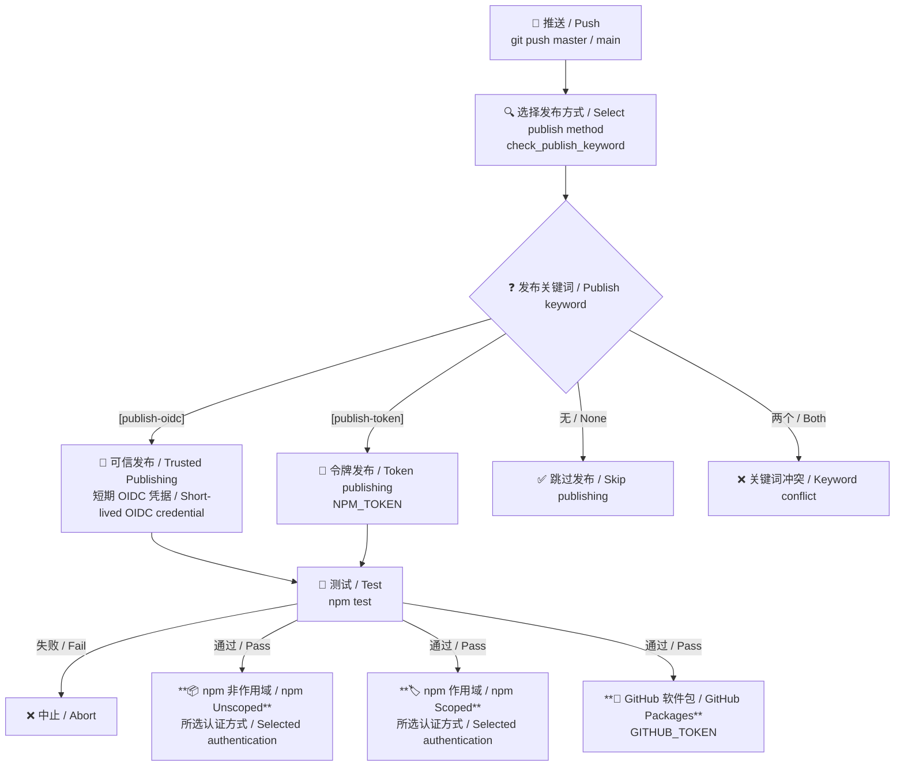

# qwq-npm-test
[](https://github.com/VincentZyuApps/qwq-npm-test/actions/workflows/publish.yml)

> 🧪 一个用于评估 npm 生态系统中 GitHub Actions CI/CD 工作流的沙盒仓库。📦<br>
> 🧪 A sandbox repository for evaluating GitHub Actions CI/CD workflows within the npm ecosystem. 📦

[](https://www.npmjs.com/package/qwq-npm-test)

[](https://www.npmjs.com/package/@vincentzyuapps/qwq-npm-test-scoped)

[](https://github.com/VincentZyuApps/qwq-npm-test/pkgs/npm/qwq-npm-test-scoped)


---

## 📊 软件包概览 / Package Overview

| 注册表<br>Registry | 软件包<br>Package | 类型<br>Type | 徽章<br>Badge |
|---|---|---|---|
| [npmjs.org](https://www.npmjs.com) | [`qwq-npm-test`](https://www.npmjs.com/package/qwq-npm-test) | 📦 npm 非作用域<br>npm Unscoped | [](https://www.npmjs.com/package/qwq-npm-test) [](https://www.npmjs.com/package/qwq-npm-test) |
| [npmjs.org](https://www.npmjs.com) | [`@vincentzyuapps/qwq-npm-test-scoped`](https://www.npmjs.com/package/@vincentzyuapps/qwq-npm-test-scoped) | 🏷️ npm 作用域<br>npm Scoped | [](https://www.npmjs.com/package/@vincentzyuapps/qwq-npm-test-scoped) [](https://www.npmjs.com/package/@vincentzyuapps/qwq-npm-test-scoped) |
| [GitHub Packages](https://github.com/features/packages) | [`@vincentzyuapps/qwq-npm-test-scoped`](https://github.com/VincentZyuApps/qwq-npm-test/pkgs/npm/qwq-npm-test-scoped) | 🐙 GitHub Packages 作用域<br>GitHub Packages Scoped | [](https://github.com/VincentZyuApps/qwq-npm-test/pkgs/npm/qwq-npm-test-scoped) |

## 📚 软件包类型说明 / Package Types Explained

本项目会向 **2 个注册表**发布 **3 个软件包**。以下是每种类型的含义：

This project publishes **3 packages** across **2 registries**. Here's what each means:

| | 📦 npm 非作用域<br>npm Unscoped | 🏷️ npm 作用域<br>npm Scoped | 🐙 GitHub Packages 作用域<br>GitHub Packages Scoped |
|---|---|---|---|
| **软件包名称**<br>**Package name** | `qwq-npm-test` | `@vincentzyuapps/qwq-npm-test-scoped` | `@vincentzyuapps/qwq-npm-test-scoped` |
| **注册表**<br>**Registry** | [npmjs.org](https://www.npmjs.com) | [npmjs.org](https://www.npmjs.com) | [npm.pkg.github.com](https://npm.pkg.github.com) |
| **默认可见性**<br>**Default visibility** | 公开<br>Public | **私有**（需要 `--access public`）<br>**Private** (requires `--access public`) | 私有（组织作用域）<br>Private (org-scoped) |
| **名称唯一性**<br>**Name uniqueness** | 全局唯一，先到先得<br>Global, first come, first served | 在 `@owner` 命名空间内唯一，不会与其他组织冲突<br>Unique under the `@owner` namespace, with no conflicts across organizations | 在 GitHub 组织命名空间内唯一<br>Unique under the GitHub organization namespace |
| **身份验证**<br>**Authentication** | `NPM_TOKEN` | `NPM_TOKEN` | `GITHUB_TOKEN` |
| **发布命令**<br>**Publish command** | `npm publish` | `npm publish --access public` | `npm publish --registry https://npm.pkg.github.com` |

### 📦 npm 非作用域 / npm Unscoped

不带 `@scope` 前缀的软件包必须拥有**全局唯一的名称**。一旦 `qwq-npm-test` 被占用，其他人就不能再使用该名称发布。它们**始终是公开的**，可使用 `npm install qwq-npm-test` 安装。

Packages without an `@scope` prefix have a **globally unique name**. Once `qwq-npm-test` is taken, nobody else can publish under that name. They are **always public** and can be installed with `npm install qwq-npm-test`.

### 🏷️ npm 作用域 / npm Scoped

作用域软件包采用 `@owner/package-name` 格式。名称只需在所属作用域内唯一，因此不必担心被其他作用域抢注。不过，npm 作用域软件包**默认为私有**，公开共享时需要使用 `--access public`。可使用 `npm install @vincentzyuapps/qwq-npm-test-scoped` 安装。

Scoped packages follow the format `@owner/package-name`. The name only needs to be unique within your scope, so you don't have to worry about name squatting. However, npm scoped packages are **private by default**, so you need `--access public` to share them publicly. Install with `npm install @vincentzyuapps/qwq-npm-test-scoped`.

### 🐙 GitHub Packages 作用域 / GitHub Packages Scoped

GitHub Packages 同样使用兼容 npm 的作用域名称（`@owner/name`），但它指向 **GitHub 自己的注册表**（`npm.pkg.github.com`），而不是 npmjs.org。它使用 `GITHUB_TOKEN` 进行身份验证；该令牌在 GitHub Actions 中自动提供，无需手动设置。这非常适合让软件包在**组织内部保持私有**，同时仍可使用 `npm install`。

GitHub Packages also uses npm-compatible scoped names (`@owner/name`), but it points to **GitHub's own registry** (`npm.pkg.github.com`) instead of npmjs.org. It uses `GITHUB_TOKEN` for authentication, which is automatically available in GitHub Actions, so no manual token setup is needed. This is useful for keeping packages **private within your organization** while still using `npm install`.

---

## 📦 手动发布到 npm / Manual Publish to npm

```bash
# 1. 初始化
# 1. Initialize
npm init -y
# 2. 登录 npm（必要时使用 proxychains 或环境变量代理）
# 2. Log in to npm (use proxychains or an environment proxy if needed)
npm login --registry https://registry.npmjs.org
# 3. 在项目根目录创建 .npmrc，并写入：
# 3. Create .npmrc in the project root and add:
#    //registry.npmjs.org/:_authToken=npm_xxxxx（从 npm 网站获取的访问令牌）
#    //registry.npmjs.org/:_authToken=npm_xxxxx (Access Token from the npm website)
echo "//registry.npmjs.org/:_authToken=npm_xxxxx" > .npmrc
# 4. 测试
# 4. Test
npm test
# 5. 发布非作用域软件包
# 5. Publish the unscoped package
npm publish --registry https://registry.npmjs.org
# 6. 发布作用域软件包
# 6. Publish the scoped package
npm pkg set name=@vincentzyuapps/qwq-npm-test-scoped
npm publish --registry https://registry.npmjs.org --access public
# 7. 将作用域软件包发布到 GitHub Packages
# 7. Publish the scoped package to GitHub Packages
# ……等等，为什么不使用 GitHub Actions CI？
# ... wait, why not use GitHub Actions CI?
```

## 🤖 通过 GitHub Actions 自动发布 / Auto Publish via GitHub Actions

工作流支持两种 npmjs.org 身份验证方式。两种方式都会运行测试并完成三个发布任务：两个 npmjs.org 软件包使用所选方式，GitHub Packages 软件包始终使用 `GITHUB_TOKEN`。

The workflow supports two authentication methods for npmjs.org. Both run the tests and complete three publish jobs: the two npmjs.org packages use the selected method, while the GitHub Packages package always uses `GITHUB_TOKEN`.

| 对比项<br>Comparison | 方法 1：可信发布（OIDC）<br>Method 1: Trusted Publishing (OIDC) | 方法 2：细粒度访问令牌<br>Method 2: Granular Access Token |
|---|---|---|
| 推荐程度<br>Recommendation | **推荐**<br>**Recommended** | 兼容方案<br>Compatibility option |
| npm 凭据<br>npm credential | 每次运行生成的短期 OIDC 凭据<br>Short-lived OIDC credential generated for each run | GitHub Secret 中保存的长期 `NPM_TOKEN`<br>Long-lived `NPM_TOKEN` stored as a GitHub Secret |
| 维护方式<br>Maintenance | 无需创建或轮换发布令牌<br>No publish token to create or rotate | 必须在到期前轮换令牌<br>Token must be rotated before expiration |
| 触发关键词<br>Trigger keyword | `[publish-oidc]` | `[publish-token]` |

### 方法 1：可信发布（OIDC，推荐） / Method 1: Trusted Publishing (OIDC, Recommended)

Trusted Publishing 使用 OpenID Connect 在 GitHub Actions 与 npm 之间建立信任关系，无需长期 `NPM_TOKEN`。npm 会为每次发布签发短期凭据，并自动生成 provenance。

Trusted Publishing uses OpenID Connect to establish trust between GitHub Actions and npm without a long-lived `NPM_TOKEN`. npm issues a short-lived credential for each publish and generates provenance automatically.

#### npmjs.com 设置 / npmjs.com Setup

分别进入以下两个软件包的 **设置（Settings）→ 可信发布（Trusted publishing）**，为每个包添加一条 GitHub Actions 配置：

Open **Settings → Trusted publishing** for each of these two packages and add a GitHub Actions configuration to each package:

- `qwq-npm-test`
- `@vincentzyuapps/qwq-npm-test-scoped`

| 字段<br>Field | 值<br>Value |
|---|---|
| 发布平台<br>Publisher | GitHub Actions |
| 组织或用户<br>Organization or user | `VincentZyuApps` |
| 仓库<br>Repository | `qwq-npm-test` |
| 工作流文件名<br>Workflow filename | `publish.yml` |
| 环境名称<br>Environment name | 留空<br>Leave blank |
| 允许的操作<br>Allowed actions | 启用 `npm publish`<br>Enable `npm publish` |

#### 页面操作步骤 / Page Setup Steps

下面的操作需要在 `qwq-npm-test` 和 `@vincentzyuapps/qwq-npm-test-scoped` 两个软件包中分别完成一次：

Complete the following steps separately for both `qwq-npm-test` and `@vincentzyuapps/qwq-npm-test-scoped`:

1. 在 **可信发布（Trusted publishing）** 表单中按上表填写 GitHub 组织、仓库和工作流文件名，环境名称保持为空。<br>
   In the **Trusted publishing** form, enter the GitHub organization, repository, and workflow filename shown above, and leave the environment name blank.
2. 在 **允许的操作（Allowed actions）** 下勾选 **Allow `npm publish`**。当前工作流直接运行 `npm publish`；如果不勾选，连接将只允许 `npm stage publish`，OIDC 发布会失败。<br>
   Under **Allowed actions**, select **Allow `npm publish`**. The current workflow runs `npm publish` directly. Without this option, the connection allows only `npm stage publish`, and OIDC publishing will fail.
3. 点击 **建立连接（Set up connection）**，创建该软件包与 GitHub Actions 工作流之间的信任关系。<br>
   Click **Set up connection** to create the trust relationship between the package and the GitHub Actions workflow.
4. 在同一软件包设置页的 **发布访问权限（Publishing access）** 中，根据是否需要保留 Token 发布选择安全策略。<br>
   Under **Publishing access** on the same package settings page, choose a security policy based on whether token publishing must remain available.
5. 点击 **更新软件包设置（Update Package Settings）** 保存发布访问权限。<br>
   Click **Update Package Settings** to save the publishing access policy.

| 使用目标<br>Goal | 发布访问权限选项<br>Publishing access option | 结果<br>Result |
|---|---|---|
| 只使用 OIDC，安全性最高<br>OIDC only, maximum security | **要求双重身份验证并禁止绕过 2FA 的令牌（推荐）**<br>**Require two-factor authentication and disallow bypass 2FA tokens (recommended)** | `[publish-oidc]` 可用；`[publish-token]` 会被 npm 拒绝<br>`[publish-oidc]` works; npm rejects `[publish-token]` |
| 同时保留 OIDC 和 Token<br>Keep both OIDC and token publishing | **要求双重身份验证，或使用已启用绕过 2FA 的细粒度访问令牌**<br>**Require two-factor authentication or a granular access token with bypass 2FA enabled** | `[publish-oidc]` 和 `[publish-token]` 都可用，但必须维护并轮换 `NPM_TOKEN`<br>Both `[publish-oidc]` and `[publish-token]` work, but `NPM_TOKEN` must be maintained and rotated |

> 如果页面当前选中的是第二项，则可以同时测试 OIDC 和 Token 两种发布方式。如果只打算长期使用 OIDC，请在 OIDC 验证成功后改选第一项，并撤销不再使用的发布令牌。<br>
> If the second option is currently selected, you can test both OIDC and token publishing. If you intend to use only OIDC long term, select the first option after OIDC has been verified and revoke the unused publish token.

> 所有字段均区分大小写，工作流文件名只能填写文件名，不能填写 `.github/workflows/publish.yml` 完整路径。详情参见 [npm Trusted Publishing 官方文档 / npm Trusted Publishing documentation](https://docs.npmjs.com/trusted-publishers/)。<br>
> All fields are case-sensitive. Enter only the workflow filename, not the full `.github/workflows/publish.yml` path. See the [npm Trusted Publishing 官方文档 / npm Trusted Publishing documentation](https://docs.npmjs.com/trusted-publishers/) for details.

当前工作流使用 GitHub 托管 runner、Node 24、npm 11.5.1 或更高版本需要的 OIDC 权限，并按以下方式发布：

The current workflow uses a GitHub-hosted runner, Node 24, the OIDC permission required by npm 11.5.1 or later, and publishes as follows:

```yaml
permissions:
  id-token: write
  contents: read

steps:
  - uses: actions/checkout@v6
  - uses: actions/setup-node@v6
    with:
      node-version: '24'
      registry-url: 'https://registry.npmjs.org'
      package-manager-cache: false
  - run: npm publish --access public
```

配置完成后，使用小写且带完整方括号的 `[publish-oidc]` 触发发布：

After setup, trigger publishing with the lowercase `[publish-oidc]` keyword and complete brackets:

```bash
# 提升版本并运行测试
# Bump the version and run tests
npm version patch --no-git-tag-version
npm test
# 提交并触发 OIDC 发布
# Commit and trigger OIDC publishing
git add -A
git commit -m "chore(release): 发布新版本 [publish-oidc]"
git push origin master
```

> Trusted Publishing 只负责 `npm publish`。如果项目需要安装私有依赖，仍需单独配置只读令牌。它目前也只支持 GitHub 托管 runner。<br>
> Trusted Publishing only authenticates `npm publish`. Installing private dependencies still requires a separate read-only token. It currently supports only GitHub-hosted runners.

### 方法 2：细粒度访问令牌 / Method 2: Granular Access Token

Token 方式通过 GitHub Secret 向 npm 提供长期凭据。它兼容未配置 Trusted Publishing 的软件包，但令牌会过期，需要定期轮换。

The token method supplies npm with a long-lived credential through a GitHub Secret. It works for packages without Trusted Publishing, but the token expires and must be rotated regularly.

| 字段<br>Field | 值<br>Value |
|---|---|
| 令牌类型<br>Token type | 细粒度访问令牌<br>Granular Access Token |
| **✔ 绕过双重身份验证**<br>**✔ Bypass 2FA** | **必须**<br>**Required** |
| 软件包和作用域 → 权限<br>Packages and scopes → Permissions | **读取和写入**<br>**Read and write** |
| 选择软件包<br>Select Packages | **所有软件包**，或同时包含 `qwq-npm-test` 和 `@vincentzyuapps/qwq-npm-test-scoped`<br>**All Packages**, or include both `qwq-npm-test` and `@vincentzyuapps/qwq-npm-test-scoped` |
| 组织<br>Organizations | 无访问权限<br>No access |
| 过期时间<br>Expiration | 设置明确的到期日期，并在到期前轮换<br>Set an explicit expiration date and rotate before it expires |

生成令牌后，在 GitHub 仓库的 **设置（Settings）→ 机密和变量（Secrets and variables）→ 操作（Actions）** 中将其保存为 `NPM_TOKEN`。

After generating the token, save it as `NPM_TOKEN` in the GitHub repository under **Settings → Secrets and variables → Actions**.

使用小写且带完整方括号的 `[publish-token]` 触发 Token 发布：

Trigger token publishing with the lowercase `[publish-token]` keyword and complete brackets:

```bash
# 提升版本并运行测试
# Bump the version and run tests
npm version patch --no-git-tag-version
npm test
# 提交并触发 Token 发布
# Commit and trigger token publishing
git add -A
git commit -m "chore(release): 发布新版本 [publish-token]"
git push origin master
```

### ⚙️ 触发规则 / Trigger Rules

推送到 `master` 或 `main` 时，GitHub Actions 会按完整提交信息选择发布方式：

When pushing to `master` or `main`, GitHub Actions selects the publish method from the complete commit message:

- **包含 `[publish-oidc]`** → npmjs.org 使用 Trusted Publishing，GitHub Packages 使用 `GITHUB_TOKEN`<br>
  **contains `[publish-oidc]`** → npmjs.org uses Trusted Publishing; GitHub Packages uses `GITHUB_TOKEN`
- **包含 `[publish-token]`** → npmjs.org 使用 `NPM_TOKEN`，GitHub Packages 使用 `GITHUB_TOKEN`<br>
  **contains `[publish-token]`** → npmjs.org uses `NPM_TOKEN`; GitHub Packages uses `GITHUB_TOKEN`
- **同时包含两个关键词** → 门禁失败，不运行测试或发布<br>
  **contains both keywords** → the gate fails; tests and publish jobs do not run
- **不包含关键词**（包括旧 `[publish-package]`）→ 门禁成功，测试和发布任务全部跳过<br>
  **contains neither keyword** (including the old `[publish-package]`) → the gate succeeds; all test and publish jobs are skipped

关键词区分大小写，并且必须包含完整方括号。

Keywords are case-sensitive and must include complete brackets.

### 🔁 CI 工作流 / CI Workflow



---

<br>
<br>
<br>
<br>
<br>


